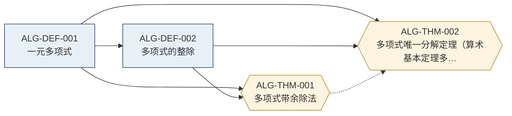
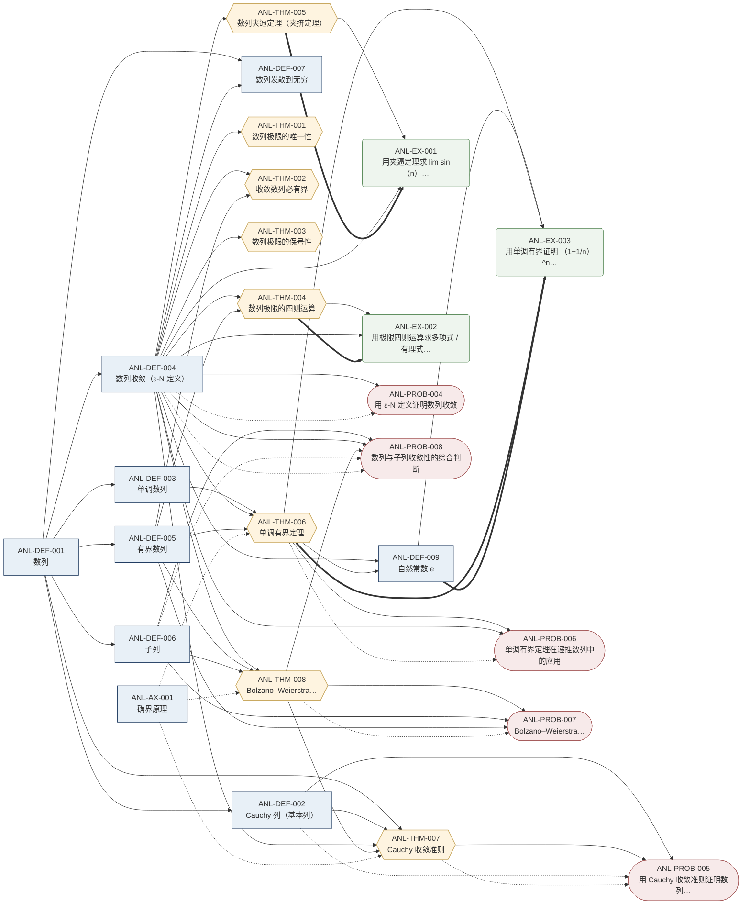
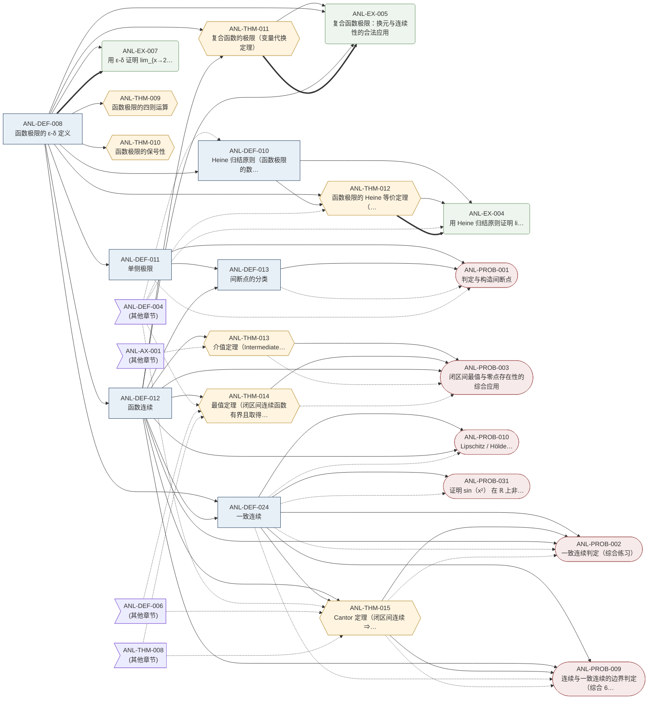
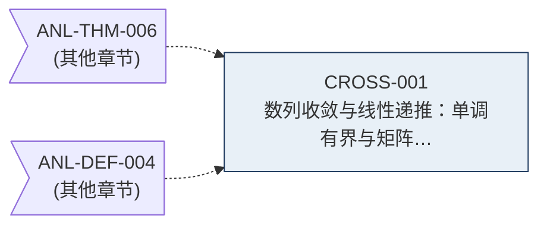

# 全库依赖图 · Dependency Graph

> 自动生成。请勿手工编辑——内容由 `scripts/build_dependency_graph.py` 扫描所有条目
> 的 frontmatter 字段 `depends / uses / illustrates / tests` 构建。

## 概览

| 指标 | 数值 |
|---|---|
| 条目总数 | 52 |
| 依赖边总数 | 125 |
| 类型分布 | definition=18 · example=6 · problem=11 · theorem=17 |
| 状态分布 | draft=5 · stable=47 |

## 边类型说明

| 字段 | 含义 | Mermaid 箭头 |
|---|---|---|
| `depends` | 前置定义 / 定理 | 实线 `-->` |
| `uses` | 依赖的公理 | 虚线 `-.->` |
| `illustrates` | 例题演示的对象 | 粗线 `==>` |
| `tests` | 习题考察的知识点 | 点划线 `-..->` |

## 节点类型说明

| 类型 | 形状 | 颜色 |
|---|---|---|
| 定义 definition | 矩形 `[ ]` | 学院蓝 |
| 定理 theorem | 六边形 `{{ }}` | 烫金 |
| 例题 example | 圆角矩形 `( )` | 草绿 |
| 习题 problem | 体育场形 `([ ])` | 砖红 |

## 全库总图

```mermaid
graph LR
  ANL-AX-001["ANL-AX-001<br/>确界原理"]
  ANL-DEF-001["ANL-DEF-001<br/>数列"]
  ANL-DEF-002["ANL-DEF-002<br/>Cauchy 列（基本列）"]
  ANL-DEF-003["ANL-DEF-003<br/>单调数列"]
  ANL-DEF-004["ANL-DEF-004<br/>数列收敛（ε-N 定义）"]
  ANL-DEF-005["ANL-DEF-005<br/>有界数列"]
  ANL-DEF-006["ANL-DEF-006<br/>子列"]
  ANL-DEF-007["ANL-DEF-007<br/>数列发散到无穷"]
  ANL-DEF-009["ANL-DEF-009<br/>自然常数 e"]
  ANL-EX-001("ANL-EX-001<br/>用夹逼定理求 lim sin（n）…")
  ANL-EX-002("ANL-EX-002<br/>用极限四则运算求多项式 / 有理式…")
  ANL-EX-003("ANL-EX-003<br/>用单调有界证明 （1+1/n）^n…")
  ANL-PROB-004(["ANL-PROB-004<br/>用 ε-N 定义证明数列收敛"])
  ANL-PROB-005(["ANL-PROB-005<br/>用 Cauchy 收敛准则证明数列…"])
  ANL-PROB-006(["ANL-PROB-006<br/>单调有界定理在递推数列中的应用"])
  ANL-PROB-007(["ANL-PROB-007<br/>Bolzano–Weierstra…"])
  ANL-PROB-008(["ANL-PROB-008<br/>数列与子列收敛性的综合判断"])
  ANL-THM-001{{"ANL-THM-001<br/>数列极限的唯一性"}}
  ANL-THM-002{{"ANL-THM-002<br/>收敛数列必有界"}}
  ANL-THM-003{{"ANL-THM-003<br/>数列极限的保号性"}}
  ANL-THM-004{{"ANL-THM-004<br/>数列极限的四则运算"}}
  ANL-THM-005{{"ANL-THM-005<br/>数列夹逼定理（夹挤定理）"}}
  ANL-THM-006{{"ANL-THM-006<br/>单调有界定理"}}
  ANL-THM-007{{"ANL-THM-007<br/>Cauchy 收敛准则"}}
  ANL-THM-008{{"ANL-THM-008<br/>Bolzano–Weierstra…"}}
  ANL-DEF-008["ANL-DEF-008<br/>函数极限的 ε-δ 定义"]
  ANL-DEF-010["ANL-DEF-010<br/>Heine 归结原则（函数极限的数…"]
  ANL-DEF-011["ANL-DEF-011<br/>单侧极限"]
  ANL-DEF-012["ANL-DEF-012<br/>函数连续"]
  ANL-DEF-013["ANL-DEF-013<br/>间断点的分类"]
  ANL-DEF-024["ANL-DEF-024<br/>一致连续"]
  ANL-EX-004("ANL-EX-004<br/>用 Heine 归结原则证明 li…")
  ANL-EX-005("ANL-EX-005<br/>复合函数极限：换元与连续性的合法应用")
  ANL-EX-007("ANL-EX-007<br/>用 ε-δ 证明 lim_{x→2…")
  ANL-PROB-001(["ANL-PROB-001<br/>判定与构造间断点"])
  ANL-PROB-002(["ANL-PROB-002<br/>一致连续判定（综合练习）"])
  ANL-PROB-003(["ANL-PROB-003<br/>闭区间最值与零点存在性的综合应用"])
  ANL-PROB-009(["ANL-PROB-009<br/>连续与一致连续的边界判定（综合 6…"])
  ANL-PROB-010(["ANL-PROB-010<br/>Lipschitz / Hölde…"])
  ANL-PROB-031(["ANL-PROB-031<br/>证明 sin（x²） 在 ℝ 上非…"])
  ANL-THM-009{{"ANL-THM-009<br/>函数极限的四则运算"}}
  ANL-THM-010{{"ANL-THM-010<br/>函数极限的保号性"}}
  ANL-THM-011{{"ANL-THM-011<br/>复合函数的极限（变量代换定理）"}}
  ANL-THM-012{{"ANL-THM-012<br/>函数极限的 Heine 等价定理（…"}}
  ANL-THM-013{{"ANL-THM-013<br/>介值定理（Intermediate…"}}
  ANL-THM-014{{"ANL-THM-014<br/>最值定理（闭区间连续函数有界且取得…"}}
  ANL-THM-015{{"ANL-THM-015<br/>Cantor 定理（闭区间连续 ⇒…"}}
  ALG-DEF-001["ALG-DEF-001<br/>一元多项式"]
  ALG-DEF-002["ALG-DEF-002<br/>多项式的整除"]
  ALG-THM-001{{"ALG-THM-001<br/>多项式带余除法"}}
  ALG-THM-002{{"ALG-THM-002<br/>多项式唯一分解定理（算术基本定理多…"}}
  CROSS-001["CROSS-001<br/>数列收敛与线性递推：单调有界与矩阵…"]
  ANL-DEF-001 --> ANL-DEF-002
  ANL-DEF-001 --> ANL-DEF-003
  ANL-DEF-001 --> ANL-DEF-004
  ANL-DEF-001 --> ANL-DEF-005
  ANL-DEF-001 --> ANL-DEF-006
  ANL-DEF-001 --> ANL-DEF-007
  ANL-DEF-004 --> ANL-DEF-007
  ANL-DEF-004 --> ANL-DEF-009
  ANL-THM-006 --> ANL-DEF-009
  ANL-THM-005 --> ANL-EX-001
  ANL-DEF-004 --> ANL-EX-001
  ANL-THM-005 ==> ANL-EX-001
  ANL-THM-004 --> ANL-EX-002
  ANL-DEF-004 --> ANL-EX-002
  ANL-THM-004 ==> ANL-EX-002
  ANL-DEF-009 --> ANL-EX-003
  ANL-THM-006 --> ANL-EX-003
  ANL-THM-006 ==> ANL-EX-003
  ANL-DEF-009 ==> ANL-EX-003
  ANL-DEF-004 --> ANL-PROB-004
  ANL-DEF-004 -..->  ANL-PROB-004
  ANL-DEF-002 --> ANL-PROB-005
  ANL-THM-007 --> ANL-PROB-005
  ANL-DEF-002 -..->  ANL-PROB-005
  ANL-THM-007 -..->  ANL-PROB-005
  ANL-THM-006 --> ANL-PROB-006
  ANL-DEF-004 --> ANL-PROB-006
  ANL-THM-006 -..->  ANL-PROB-006
  ANL-THM-008 --> ANL-PROB-007
  ANL-DEF-006 --> ANL-PROB-007
  ANL-DEF-005 --> ANL-PROB-007
  ANL-THM-008 -..->  ANL-PROB-007
  ANL-DEF-006 --> ANL-PROB-008
  ANL-DEF-004 --> ANL-PROB-008
  ANL-THM-008 --> ANL-PROB-008
  ANL-DEF-006 -..->  ANL-PROB-008
  ANL-DEF-004 -..->  ANL-PROB-008
  ANL-DEF-004 --> ANL-THM-001
  ANL-DEF-004 --> ANL-THM-002
  ANL-DEF-005 --> ANL-THM-002
  ANL-DEF-004 --> ANL-THM-003
  ANL-DEF-004 --> ANL-THM-004
  ANL-DEF-005 --> ANL-THM-004
  ANL-DEF-004 --> ANL-THM-005
  ANL-DEF-003 --> ANL-THM-006
  ANL-DEF-004 --> ANL-THM-006
  ANL-DEF-005 --> ANL-THM-006
  ANL-AX-001 -.->  ANL-THM-006
  ANL-DEF-001 --> ANL-THM-007
  ANL-DEF-002 --> ANL-THM-007
  ANL-DEF-004 --> ANL-THM-007
  ANL-THM-008 --> ANL-THM-007
  ANL-AX-001 -.->  ANL-THM-007
  ANL-DEF-004 --> ANL-THM-008
  ANL-DEF-005 --> ANL-THM-008
  ANL-DEF-006 --> ANL-THM-008
  ANL-AX-001 -.->  ANL-THM-008
  ANL-DEF-004 --> ANL-DEF-010
  ANL-DEF-008 --> ANL-DEF-010
  ANL-DEF-008 --> ANL-DEF-011
  ANL-DEF-008 --> ANL-DEF-012
  ANL-DEF-011 --> ANL-DEF-013
  ANL-DEF-012 --> ANL-DEF-013
  ANL-DEF-008 --> ANL-DEF-024
  ANL-DEF-012 --> ANL-DEF-024
  ANL-DEF-010 --> ANL-EX-004
  ANL-THM-012 --> ANL-EX-004
  ANL-DEF-004 --> ANL-EX-004
  ANL-THM-012 ==> ANL-EX-004
  ANL-THM-011 --> ANL-EX-005
  ANL-DEF-008 --> ANL-EX-005
  ANL-DEF-012 --> ANL-EX-005
  ANL-THM-011 ==> ANL-EX-005
  ANL-DEF-008 --> ANL-EX-007
  ANL-DEF-008 ==> ANL-EX-007
  ANL-DEF-011 --> ANL-PROB-001
  ANL-DEF-013 --> ANL-PROB-001
  ANL-DEF-013 -..->  ANL-PROB-001
  ANL-DEF-011 -..->  ANL-PROB-001
  ANL-DEF-024 --> ANL-PROB-002
  ANL-THM-015 --> ANL-PROB-002
  ANL-DEF-012 --> ANL-PROB-002
  ANL-DEF-024 -..->  ANL-PROB-002
  ANL-THM-015 -..->  ANL-PROB-002
  ANL-THM-013 --> ANL-PROB-003
  ANL-THM-014 --> ANL-PROB-003
  ANL-DEF-012 --> ANL-PROB-003
  ANL-THM-013 -..->  ANL-PROB-003
  ANL-THM-014 -..->  ANL-PROB-003
  ANL-DEF-024 --> ANL-PROB-009
  ANL-DEF-012 --> ANL-PROB-009
  ANL-THM-015 --> ANL-PROB-009
  ANL-DEF-024 -..->  ANL-PROB-009
  ANL-THM-015 -..->  ANL-PROB-009
  ANL-DEF-024 --> ANL-PROB-010
  ANL-DEF-012 --> ANL-PROB-010
  ANL-DEF-024 -..->  ANL-PROB-010
  ANL-DEF-024 --> ANL-PROB-031
  ANL-DEF-024 -..->  ANL-PROB-031
  ANL-DEF-008 --> ANL-THM-009
  ANL-DEF-008 --> ANL-THM-010
  ANL-DEF-008 --> ANL-THM-011
  ANL-DEF-012 --> ANL-THM-011
  ANL-DEF-008 --> ANL-THM-012
  ANL-DEF-010 --> ANL-THM-012
  ANL-DEF-004 --> ANL-THM-012
  ANL-DEF-012 --> ANL-THM-013
  ANL-AX-001 -.->  ANL-THM-013
  ANL-DEF-012 --> ANL-THM-014
  ANL-DEF-004 --> ANL-THM-014
  ANL-DEF-006 --> ANL-THM-014
  ANL-THM-008 -.->  ANL-THM-014
  ANL-DEF-012 --> ANL-THM-015
  ANL-DEF-024 --> ANL-THM-015
  ANL-DEF-004 --> ANL-THM-015
  ANL-DEF-006 --> ANL-THM-015
  ANL-THM-008 -.->  ANL-THM-015
  ALG-DEF-001 --> ALG-DEF-002
  ALG-DEF-001 --> ALG-THM-001
  ALG-DEF-002 --> ALG-THM-001
  ALG-DEF-001 --> ALG-THM-002
  ALG-DEF-002 --> ALG-THM-002
  ALG-THM-001 -.->  ALG-THM-002
  ANL-THM-006 --> CROSS-001
  ANL-DEF-004 --> CROSS-001
  class ANL-AX-001,ANL-DEF-001,ANL-DEF-002,ANL-DEF-003,ANL-DEF-004,ANL-DEF-005,ANL-DEF-006,ANL-DEF-007,ANL-DEF-009,ANL-DEF-008,ANL-DEF-010,ANL-DEF-011,ANL-DEF-012,ANL-DEF-013,ANL-DEF-024,ALG-DEF-001,ALG-DEF-002,CROSS-001 defNode
  class ANL-EX-001,ANL-EX-002,ANL-EX-003,ANL-EX-004,ANL-EX-005,ANL-EX-007 exNode
  class ANL-PROB-004,ANL-PROB-005,ANL-PROB-006,ANL-PROB-007,ANL-PROB-008,ANL-PROB-001,ANL-PROB-002,ANL-PROB-003,ANL-PROB-009,ANL-PROB-010,ANL-PROB-031 probNode
  class ANL-THM-001,ANL-THM-002,ANL-THM-003,ANL-THM-004,ANL-THM-005,ANL-THM-006,ANL-THM-007,ANL-THM-008,ANL-THM-009,ANL-THM-010,ANL-THM-011,ANL-THM-012,ANL-THM-013,ANL-THM-014,ANL-THM-015,ALG-THM-001,ALG-THM-002 thmNode
  classDef defNode  fill:#e8f0f7,stroke:#1e3a5f,stroke-width:1px;
  classDef thmNode  fill:#fef4e0,stroke:#c9a961,stroke-width:1.5px;
  classDef exNode   fill:#eef5ee,stroke:#5a8a5a,stroke-width:1px;
  classDef probNode fill:#f7eaea,stroke:#a55a5a,stroke-width:1px;
```

## 按章节分图

### `algebra/01-polynomials` （4 条）

### `analysis/01-limits` （25 条）

### `analysis/02-continuity` （22 条）

### `cross/_cross` （1 条）

## 高入度条目（被引用最多 = 知识基石）

| 排名 | ID | 标题 | 入度 |
|---|---|---|---|
| 1 | `ANL-DEF-004` | 数列收敛（ε-N 定义） | 23 |
| 2 | `ANL-DEF-008` | 函数极限的 ε-δ 定义 | 11 |
| 3 | `ANL-DEF-012` | 函数连续 | 11 |
| 4 | `ANL-DEF-024` | 一致连续 | 9 |
| 5 | `ANL-DEF-001` | 数列 | 7 |
| 6 | `ANL-THM-006` | 单调有界定理 | 6 |
| 7 | `ANL-THM-008` | Bolzano–Weierstrass 定理（致密性定理） | 6 |
| 8 | `ANL-DEF-006` | 子列 | 6 |
| 9 | `ANL-DEF-005` | 有界数列 | 5 |
| 10 | `ANL-AX-001` | 确界原理 | 4 |

## 高出度条目（依赖最多 = 综合性强）

| 排名 | ID | 标题 | 出度 |
|---|---|---|---|
| 1 | `ANL-PROB-008` | 数列与子列收敛性的综合判断 | 5 |
| 2 | `ANL-THM-007` | Cauchy 收敛准则 | 5 |
| 3 | `ANL-PROB-002` | 一致连续判定（综合练习） | 5 |
| 4 | `ANL-PROB-003` | 闭区间最值与零点存在性的综合应用 | 5 |
| 5 | `ANL-PROB-009` | 连续与一致连续的边界判定（综合 6 题） | 5 |
| 6 | `ANL-THM-015` | Cantor 定理（闭区间连续 ⇒ 一致连续） | 5 |
| 7 | `ANL-EX-003` | 用单调有界证明 (1+1/n)^n 收敛（自然常数 e 的存在性） | 4 |
| 8 | `ANL-PROB-005` | 用 Cauchy 收敛准则证明数列收敛性 | 4 |
| 9 | `ANL-PROB-007` | Bolzano–Weierstrass 定理的应用：证明命题 | 4 |
| 10 | `ANL-THM-006` | 单调有界定理 | 4 |
